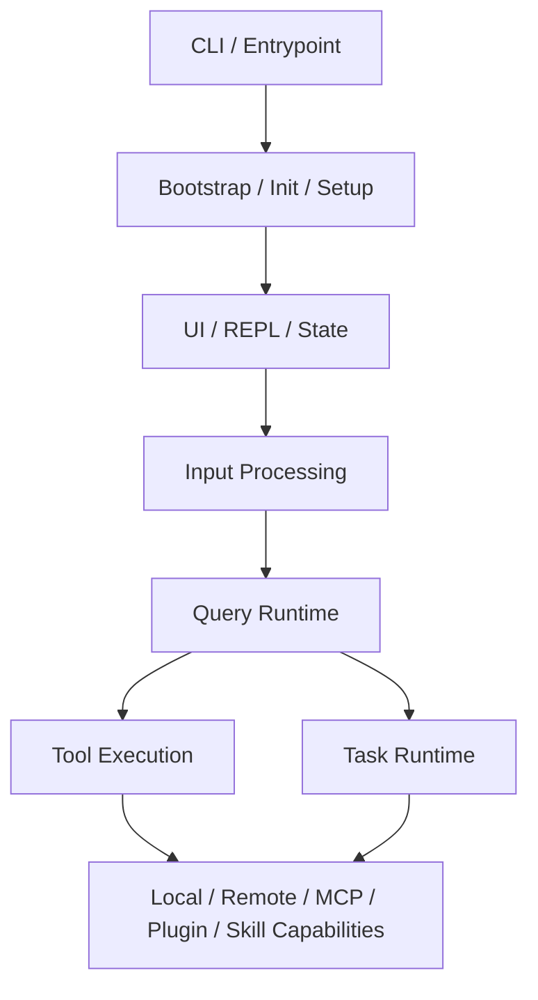
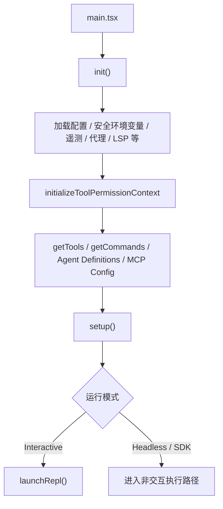
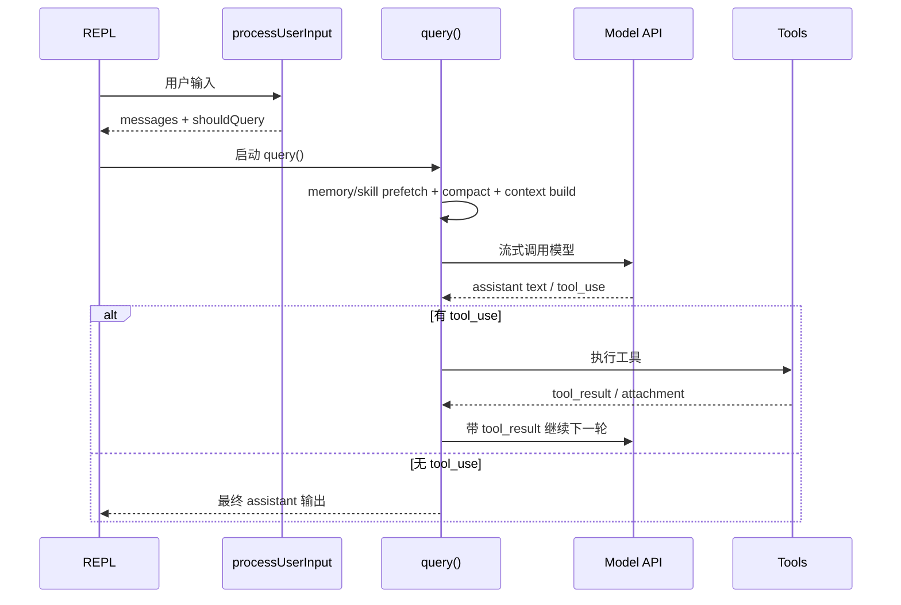

# Claude Code 架构说明

本文档基于当前仓库代码，对 Claude Code 的整体架构、模块职责和运行流程做一次工程化整理。重点不是逐文件解释，而是回答三个问题：

1. 这个项目按什么层次组织
2. 各模块在运行时分别承担什么职责
3. 一次用户输入是如何在系统里流转并最终完成的

注意：本仓库是对 Claude Code 发布包源码的非官方抽取版本，文档中的判断以当前代码为准。

## 1. 项目定位

Claude Code 不是一个普通的“聊天 UI”，而是一个运行在终端里的开发 Agent 运行时。它同时具备下面几类能力：

- CLI 启动、配置、会话和权限管理
- 交互式终端 UI
- 多轮模型推理与工具调用闭环
- 文件、Shell、Git、Web、MCP 等工具执行
- 后台任务、子 Agent、远程 Agent 和多会话管理
- skills、plugins、MCP server 带来的扩展能力

从工程视角看，这个项目的核心不是某个单独工具，而是一个统一的 Agent Runtime。

## 2. 总体分层

可以把项目分成 8 层：

### 2.1 CLI 与入口层

职责：

- 解析命令行参数
- 决定运行模式：交互式 REPL、print/headless、SDK、remote、assistant viewer
- 初始化全局环境与配置
- 装配 commands、tools、agents、MCP 配置

关键文件：

- `src/main.tsx`
- `src/entrypoints/init.ts`
- `src/setup.ts`
- `src/interactiveHelpers.tsx`
- `src/replLauncher.tsx`

这一层回答的是“程序怎么启动”和“本次进程应该进入哪条主流程”。

### 2.2 Bootstrap / 配置 / 环境层

职责：

- 维护会话级全局状态
- 加载配置、环境变量、模型设置、权限模式
- 初始化 analytics、LSP、remote managed settings、policy limits
- 设置 cwd、session id、worktree、tmux、remote 相关基础设施

关键目录：

- `src/bootstrap/`
- `src/utils/config*`
- `src/utils/settings/`
- `src/services/remoteManagedSettings/`
- `src/services/policyLimits/`

这一层偏“运行环境装配”，给上层提供稳定的上下文。

### 2.3 UI / REPL / State 层

职责：

- 用 Ink/React 渲染终端 UI
- 管理消息列表、输入框、状态栏、任务区、权限弹窗
- 维护会话期的 AppState
- 把用户输入提交给运行时

关键文件：

- `src/screens/REPL.tsx`
- `src/components/`
- `src/hooks/`
- `src/state/AppStateStore.ts`
- `src/state/store.ts`
- `src/state/onChangeAppState.ts`

这里的 `AppState` 不是业务数据库，而是当前会话的“前端运行时状态”，比如：

- 当前消息
- 当前 permission mode
- 当前 task 列表
- 当前 MCP 连接状态
- 当前插件与 agent 定义

### 2.4 输入解释层

职责：

- 处理用户 prompt
- 识别 slash command
- 展开 pasted text / image 引用
- 注入附件、记忆、IDE 上下文、hook 结果
- 决定这次输入是否进入模型推理

关键文件：

- `src/utils/processUserInput/processUserInput.ts`
- `src/utils/processUserInput/processSlashCommand.tsx`
- `src/history.ts`
- `src/utils/attachments.ts`
- `src/commands.ts`

这层很像“编译前端”：把原始输入转换成结构化的消息和控制指令。

### 2.5 Query Runtime 层

职责：

- 驱动一次完整的 Agent turn
- 维护消息递归推进
- 调用模型并处理流式输出
- 检测 tool_use
- 回灌 tool_result、attachment、task notification
- 执行 compact、memory prefetch、skill prefetch、stop hooks、token budget

关键文件：

- `src/query.ts`
- `src/QueryEngine.ts`
- `src/query/config.ts`
- `src/query/deps.ts`
- `src/query/stopHooks.ts`
- `src/query/tokenBudget.ts`

这是全项目最核心的执行内核。

### 2.6 Tool Execution 层

职责：

- 定义模型可见的工具
- 校验输入 schema
- 处理权限
- 串行或并行执行工具
- 产出标准化 `tool_result`

关键文件：

- `src/Tool.ts`
- `src/tools.ts`
- `src/services/tools/toolExecution.ts`
- `src/services/tools/toolOrchestration.ts`
- `src/services/tools/StreamingToolExecutor.ts`

典型工具包括：

- Bash / PowerShell
- FileRead / FileEdit / FileWrite / NotebookEdit
- WebFetch / WebSearch
- AgentTool
- MCPTool
- Todo / Task / Config / Skill 等辅助工具

### 2.7 Task Runtime 层

职责：

- 承载长生命周期工作单元
- 支持后台运行、状态跟踪、通知回灌和任务终止
- 把“耗时执行”从同步工具调用中拆出来

关键文件：

- `src/Task.ts`
- `src/tasks.ts`
- `src/tasks/LocalShellTask/LocalShellTask.tsx`
- `src/tasks/LocalAgentTask/LocalAgentTask.tsx`
- `src/tasks/RemoteAgentTask/RemoteAgentTask.tsx`
- `src/tasks/LocalMainSessionTask.ts`

这一层很重要。Claude Code 不是把所有事情都做成同步 RPC，而是把长任务升级成运行时一级对象。

### 2.8 扩展能力层

职责：

- 接入外部协议和扩展来源
- 把外部工具和命令并入统一运行时

关键子系统：

- MCP：`src/services/mcp/`
- Skills：`src/skills/`
- Plugins：`src/plugins/` 与 `src/utils/plugins/`
- Remote / Bridge：`src/remote/`、`src/bridge/`

这一层让 Claude Code 不只是“内建工具集”，而是可持续扩展的 Agent 平台。

## 3. 按模块拆解

下面按目录总结主要模块。

### 3.1 `src/main.tsx`

这是全局入口，负责：

- 命令行参数解析
- 初始化配置和启动前检查
- 决定运行模式
- 加载 commands / tools / agents / MCP 配置
- 启动 REPL 或 headless 路径

可以把它看作总装配器，而不是业务逻辑实现者。

### 3.2 `src/screens/REPL.tsx`

这是交互式模式的主控制器，职责很多：

- 接收用户输入
- 更新消息列表
- 构造 `toolUseContext`
- 调用 `query()`
- 渲染 streaming 消息、tool progress、task 区域、权限请求
- 管理中断、恢复、背景任务、队列消费

REPL 本质上是“界面 + 编排层”，真正的模型闭环还是交给 `query.ts`。

### 3.3 `src/query.ts`

这是核心运行时，整体是一个递归推进的循环：

- 接收当前消息和上下文
- 预处理上下文
- 调用模型流
- 收集 assistant message 和 tool_use
- 执行工具
- 将 tool_result、附件、通知追加到消息列表
- 如果还要继续，则进入下一轮

它同时处理几个复杂问题：

- compact / microcompact / context collapse
- prompt too long 恢复
- max output tokens 恢复
- stop hooks
- token budget
- memory 与 skill 预取
- streaming tool execution

### 3.4 `src/QueryEngine.ts`

`QueryEngine` 是对 query 生命周期的进一步封装，偏 SDK / headless 使用，也体现出架构演进方向：

- 将“会话状态”从单次函数调用中抽出来
- 把多轮会话消息、usage、permission denials、readFileCache 等状态对象化
- 为未来统一 REPL 与 SDK 内核提供基础

可以理解为：`query.ts` 是“主循环算法”，`QueryEngine.ts` 是“会话级 runtime 对象”。

### 3.5 `src/commands.ts` 与 `src/commands/`

slash command 并不只是本地命令。这里的 command 分为多种类型：

- prompt 型：把命令转写成 prompt，再交给模型
- local-jsx 型：本地直接弹出 UI 或执行本地逻辑
- fork / agent 型：交给子 Agent 或后台任务

也就是说，command 系统更像“用户级入口 DSL”，不是简单的 CLI 子命令集合。

### 3.6 `src/tools.ts` 与 `src/tools/`

这里维护模型可用工具池。每个工具通常包含：

- 名称和 prompt 描述
- 输入输出 schema
- 是否启用
- 是否支持并发
- 调用逻辑
- UI 渲染逻辑

工具层面向模型；运行时通过 `ToolUseContext` 将状态、权限、任务系统、消息系统注入给工具。

### 3.7 `src/tasks/`

这里是后台执行体系。Claude Code 把以下对象都提升成 task：

- 后台 shell 命令
- 本地子 Agent
- remote Agent
- dream / workflow / monitor 等特殊任务

task 的关键价值：

- 生命周期可见
- 结果可追踪
- 可以通知主会话
- 可以被终止
- 可以被 foreground/background 切换

### 3.8 `src/services/mcp/`

MCP 子系统负责：

- 读取 MCP 配置
- 建立 MCP client 连接
- 拉取 tools / resources / prompts / commands
- 处理认证、reconnect、channel、resource 读取、tool call

MCP 是 Claude Code 的重要扩展边界。它不是外挂，而是被并入统一 tool pool 的一级能力。

### 3.9 `src/skills/` 与 `src/utils/plugins/`

skills 和 plugins 让系统获得“文本化扩展能力”：

- skills 多来自 Markdown/frontmatter
- plugins 可以注入 commands、skills、MCP server、设置等

这两个系统让 Claude Code 获得了比较强的可配置性，也说明它不是一个封闭硬编码产品。

### 3.10 `src/services/api/`

这里负责和模型 API 交互，包括：

- 构造请求
- 流式读取响应
- 计算 usage / cost
- fallback / retry
- provider 兼容

其中 `src/services/api/claude.ts` 是模型调用的关键实现。

### 3.11 `src/services/compact/`

这是上下文治理子系统。随着会话变长，必须压缩历史，否则模型成本和上下文长度都会失控。

这里不是单一 compact，而是多种机制并行：

- microcompact
- autoCompact
- reactiveCompact
- context collapse
- session memory compact

这说明 Claude Code 的运行时设计目标不是“首轮能跑”，而是“长会话也能跑”。

## 4. 运行流程

下面按实际运行路径说明。

### 4.1 启动流程

关键点：

- 启动时并不会立刻调用模型
- 先把环境、权限、工具池、扩展点准备好
- 交互和非交互路径共享很多底层能力，只是入口不同

### 4.2 交互式输入流程

用户在 REPL 里输入一段文字后，大致经历以下阶段：

1. REPL 接收输入
2. `processUserInput()` 预处理输入
3. 生成新的 messages
4. 构造 `toolUseContext`
5. 调用 `query()`
6. 将流式消息实时渲染到 UI

如果是 slash command，则不一定进入模型：

- 有些命令转成 prompt
- 有些命令本地执行
- 有些命令 fork 到子 Agent

### 4.3 单次 Query 流程

这是最核心的路径。

### 4.4 工具执行流程

模型输出 `tool_use` 后，不是直接执行系统命令，而是先进入工具运行时：

1. 解析 tool name 和 input
2. 查找 tool 定义
3. 做 schema 校验
4. 做权限判断
5. 判断能否并发执行
6. 执行工具
7. 产出标准化 `tool_result`
8. 将结果写回消息流

这里还会处理：

- streaming progress
- hook
- 失败恢复
- 结果截断与持久化
- 文件变更和 shell 输出的专门渲染

### 4.5 后台任务流程

不是所有工具都在当前轮里同步完成。以 BashTool、AgentTool 为例，如果任务较长，就会变成 Task。

流程如下：

1. 工具触发长任务
2. Runtime 注册 TaskState
3. 任务转后台运行
4. UI 显示任务进度
5. 任务完成后产出 notification / output file
6. 主会话在后续轮次中将该通知作为 attachment 或 queued command 消费

这让 Claude Code 具备了比较强的异步工作能力。

### 4.6 Headless / SDK 路径

交互式 REPL 不是唯一入口。print/SDK 模式同样会走相似的 query runtime，只是：

- 没有完整 REPL UI
- 事件通过结构化流输出
- 更偏自动化和嵌入式调用

这也是 `QueryEngine` 存在的重要背景：同一套 runtime 要适配多种入口。

## 5. 关键设计特点

### 5.1 这是一个“运行时优先”的系统

系统真正的核心不是 Prompt，而是 Runtime：

- 消息如何推进
- 工具如何执行
- 长任务如何管理
- 上下文如何压缩
- 权限如何约束

模型只是其中一个参与者。

### 5.2 强调长会话稳定性

从 compact、memory、task、resume、sessionStorage、background task 这些模块可以看出，它不是只优化一轮对话，而是面向持续工作的 coding session。

### 5.3 扩展性是一级目标

MCP、skills、plugins、agents、worktree、remote 都说明这个系统从一开始就不是“单一内建能力”的设计。

### 5.4 UI 与 Runtime 分工清楚

REPL 很大，但主要负责交互编排；真正的 agent 主循环还是收敛在 `query.ts`。

### 5.5 Tool 和 Task 分层非常关键

这是这个项目最值得借鉴的工程抽象之一：

- Tool 是模型能力接口
- Task 是运行时执行实体

如果没有这层分离，系统很难做后台 agent、长命令、通知回灌和远程执行。

## 7. 总结

从工程架构上说，Claude Code 可以概括为：

- 入口层负责启动与装配
- REPL 层负责交互与状态
- 输入解释层负责把用户输入转换成结构化消息
- Query Runtime 负责多轮 Agent 主循环
- Tool 层负责模型可调用能力
- Task 层负责长生命周期执行
- MCP / skills / plugins 负责扩展
- compact / memory / permission 负责系统长期稳定性

它本质上是一个面向开发场景的 Agent Runtime，而不是一个简单的终端聊天程序。
